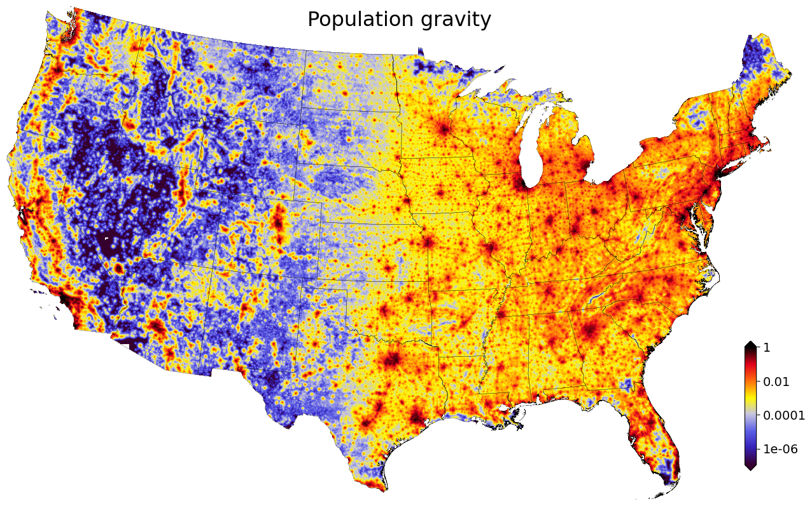

Population gravity
==================

"Population gravity" is an experimental spatial measure developed at the PLACES lab.

It is a high-resolution measure of "proximity to people".

It takes into account both population counts (densities) and proximity to people (spatial distance from residential buildings).

Its purpose is to capture the **urban-rural gradient**, one of the most important drivers of land value in the United States.

Computationally, we use residential building footprints and distribute census-block population counts among them. This gives us an estimate of where everyone lives. We then apply a spatial decay function to this raster to create a 2D measure of "population gravity": how much a location's prices are affected by its proximity to all people.

We picked the name "population gravity", as the measure is a function of both "mass" and "distance". (Although we're not using a squared decay function as in physical gravity).

**************
Data & Methods
**************

We start with :ref:`Microsoft building footprints <Buildings>`.

We identify residential building footprints by excluding commercial, industrial, and governmental buildings using on :ref:`parcel boundaries <Parcels>` linked to :ref:`tax assessor records <Tax assessor records>` and ZTRAX' proprietary land use classification (:any:`bld_code`).

We rasterize these **residential building footprints** at 15m resolution.

We then create a raster that "fills" these pixels with the population from the census block: each residential building pixel receives an equal fraction of the total population count.

We mosaic and aggregate these "people-in-buildings" rasters to the contiguous United States at 480m resolution.

We then apply an exponential spatial decay function (2D raster convolutions) to create the "population gravity" raster.

As the decay function was unknown, we considered several functions (Gaussian, exponential, different decay parameters). Among this group, we picked the one that gave us the best statistical fit (lowest error) in a nationwide linear regressions of land values on population gravity and other covariates:

:Decay formula: :math:`e^{-\frac{1}{1920m} distance}`

***********
Limitations
***********

The measure does not take into account travel time (terrain, rivers, roads, etc.). This would be a great extension. Existing travel time layers (Nelson 2008, Weiss et al. 2017) were not a suitable substitute, as they ignore smaller cities and do not take into account the various sizes of larger cities (college town vs. major metro areas).
