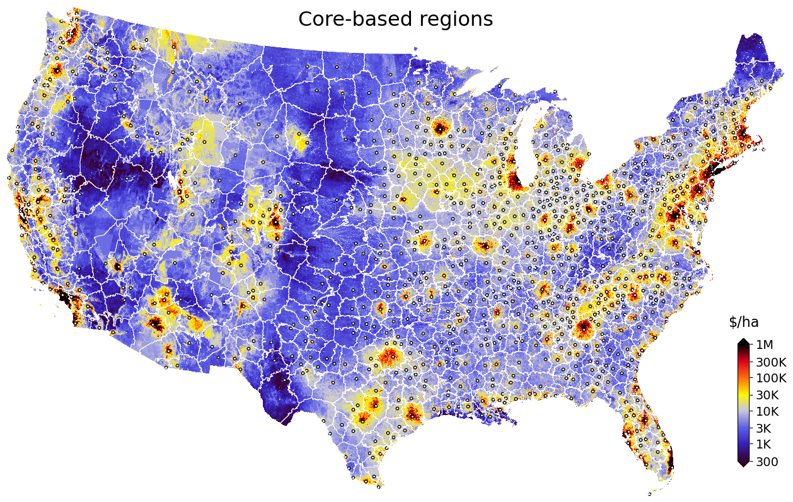

Core-based regions
==================

.. image:: regions.png
  :width: 350
  :alt: Regions
  :align: right

"Regions" are our data-driven attempt to subdivide the CONUS landscape into spatial units that share common characteristics in drivers of land values.

Regions attribute each location in the contiguous United States to its closest high-value core (cities or resorts) that appears to be the dominant driver of land value within that region.

We use these core-based regions as a spatial unit in many land value :ref:`models <Models>`:

* to train separate models of land value for each "high-value" core.

* to understand region-specific drivers of land value and regional uncertainties.

* to model transitions in land value gradients between neighboring regions.

* to account for idiosycratic regional land price differences in nationwide models (regional fixed effects).

* to impute models for data-scarce regions from regions with similar observable characteristics.

**********
Principles
**********

Regions are defined by their high-value core
############################################

Cores are population centers that drive nearby land prices. Most cores are city centers (metropolitan or micropolitan areas). Others are recreational resorts (ski areas, lakes, beaches) that create their own local price gradients (e.g., Aspen in Colorado, The Hamptons on Long Island).

Regions are separated by low land values
########################################

Which land area is attributed to a "core" is determined by geographic rent gradients, i.e., observed changes in estimated land values across space. Such shapes are neither circular, nor do they follow administrative boundaries. They can be idiosyncratic as a function of geography and infrastructure (e.g., around a lake, within a long valley, etc.), but also due to local misestimation of land value. The underlying assumption is that a local minimum in the rent gradient identifies the set of locations where two cores exert a similarly strong influence on land prices, i.e., a boundary between core-based areas.

*********************
How we create regions
*********************

Start with core-based statistical areas (CBSA)
##############################################

We start with Core-Based Statistical Areas (CBSAs) from the U.S. Census.

CBSAs are defined at the county-level and can include one or several counties. We include metropolitan statistical areas (MSA) and micropolitan statistical areas.

Within each CBSA, we identify the location with the highest neighborhood population density based on our ":ref:`population gravity <Population gravity>`" raster (:any:`bld_pop_exp_c4`) derived from population counts and residential building locations.

We smoothe this population raster with a Gaussian decay function to remove very localized peaks (usually errors). We then select the location of the pixel with the highest value within the CBSA as the "core": the starting point of the :any:`region-growing algorithm <Grow regions>`.

Add resorts and secondary cores
###############################

We manually add locations of other cores (other areas with locally high land values) through visual inspection of the published PLACES-FMV from *Nolte (2020) PNAS* (`article <https://www.pnas.org/doi/10.1073/pnas.2012865117>`_, `data <https://doi.org/10.5061/dryad.np5hqbzq9>`_).

These additions belong mostly to:

* Recreation hotspots (e.g. Aspen, Sedona, The Hamptons, several large lakes) that affect local land values in spite of having low population densities (few permanent residents)::

    CORES_REC = {
        'AZ': ['Lake Powell', 'Sedona', 'Lakeside'],
        'CA': ['Mendocino'],
        'CO': ['Aspen', 'Estes Park', 'Granby', 'Telluride', 'Pagosa Springs'],
        'GA': ['Lake Oconee', 'Lake Chatuga'],
        'MA': ['Nantucket'],
        'ME': ['Desert Island'],
        'MD': ['Deep Creek Lake'],
        'NC': ['Lake Norman', 'Highlands'],
        'NH': ['Littleton', 'North Conway'],
        'NY': ['The Hamptons', 'Eagle Bay', 'Saranac Lake'],
        'OK': ['Hochatown'],
        'VA': ['Smith Mountain Lake', 'Cape Charles'],
        'WI': ['Woodruff'],
    }

* Cities or towns that share a county with another large population center, but are far enough away to create their own local price gradient (e.g., Santa Barbara and Santa Maria in California)::

    CORES_CITY = {
        'AR': ['Conway'],
        'AZ': ['Bullhead City', 'Kingman'],
        'CA': [
            'Bishop',
            'Lancaster',
            'Monterey',
            'Palm Springs',
            'Paso Robles',
            'Ridgecrest',
            'Santa Barbara',
            'Victorville',
            'Walnut Creek',
        ],
        'CT': ['Danbury', 'Bristol'],
        'LA': ['Covington', 'Slidell'],
        'MA': ['New Bedford', 'Fitchburg', 'Amherst'],
        'ME': ['Augusta', 'Presque Isle'],
        'MD': ['Frederick', 'Annapolis', 'Ocean City'],
        'MI': ['Port Huron'],
        'NC': ['Waynesville'],
        'NH': ['Nashua', 'Portsmouth'],
        'NJ': ['Long Branch'],
        'NY': ['Middletown'],
        'PA': ['Hazleton'],
        'SC': ['Anderson'],
        'VA': ['Fredericksburg', 'Hampton'],
        'VT': ['Middlebury'],
    }

Grow regions
############

We use a region-growing algorithm - the ``watershed`` image segmentation algorithm from the ``scikit-image`` Python package - to assign each 480m pixel in CONUS to the core believed to drive the land price gradient in its neighborhood.

As a wall-to-wall estimate of the land value gradient, we use the 2010 CONUS land value raster published in *Nolte (2020) PNAS* (`article <https://www.pnas.org/doi/10.1073/pnas.2012865117>`_, `data <https://doi.org/10.5061/dryad.np5hqbzq9>`_, main model with buildings).

The figure visualizes resulting regions (boundaries and color shades) with their corresponding cores (dots), overlaid over a map of the land value raster used in the rent gradient (blue > yellow > red: cheap > expensive). Large cities create larger regions (e.g., Atlanta). Where land gradients are flat (e.g., in the Great Plains), regions look like `Thiessen polygons in a Voronoi diagram <https://en.wikipedia.org/wiki/Voronoi_diagram>`_.
