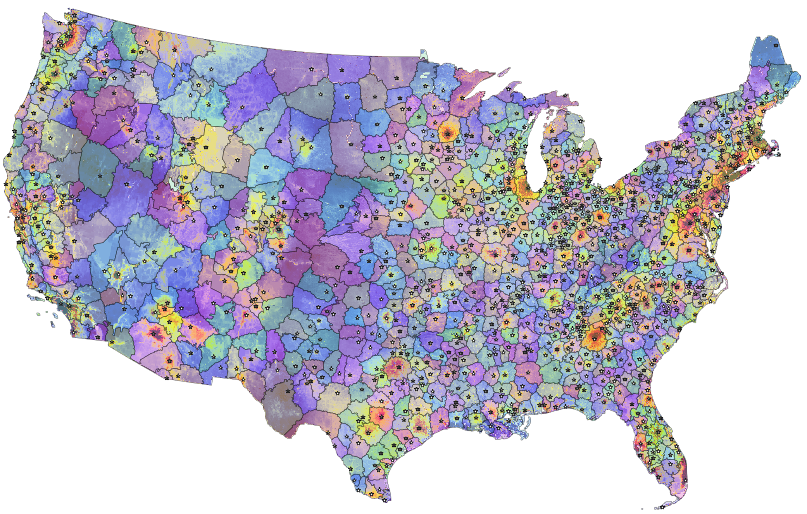

Core-based regions
==================

Regions are our data-driven attempt to subdivide the CONUS landscape into spatial blocks that share common characteristics in their drivers of land values but that are not constrained by county boundaries. We speculate that some regional land value models will have higher predictive accuracy and interpretability overall than county-level models.

Our current approach to creating regions is to attribute each part of the U.S. landscape to a high-value core (usually cities or resorts) whose proximity drives the land rent gradient within that region.

We use these core-based regions as spatial units in the land value models:

* for region-specific valuation models (where sufficient data is available).
* for region-specific uncertainty and error metrics.
* in OLS models: for regional fixed effects or regionally varying coefficients.
* in data-scarce regions: for the imputation of models behavior, using regions with similar characteristics.

**********
Principles
**********

Regions are defined by their high-value core
############################################

Cores are centers of attraction that drive nearby land prices up. Most cores are city centers (metropolitan or micropolitan areas). However, some recreational locations (e.g., high-end natural amenity resorts, e.g., near mountains and lakes) can create their own local price gradients (e.g., Aspen in Colorado, The Hamptons on Long Island).

Regions are separated by low land values
########################################

Which land area is attributed to a "core" is determined by two-dimensional rent gradients, i.e., observed changes in estimated land values across space. Such shapes are neither circular, nor do they follow administrative boundaries. Instead, they can be idiosyncratic as a function of geography and infrastructure (e.g., around a lake, within a long valley, etc.). The underlying assumption is that a local minimum in the rent gradient indicates that we're at a location where two cores have a similarly strong influence, i.e., a boundary between core-based areas.

****************
Creating regions
****************

Start with population centers
#############################

We start with the population centers Core-Based Statistical Areas (CBSAs) from the U.S. Census. CBSAs are defined at the county-level (single county or groups of counties), and thus inherit their geography. They include both metropolitan statistical areas (MSA) and micropolitan statistical areas.

Within each CBSA, we find the location with the highest neighborhood population density by:

* allocating census-block-level data (American Community Survey, 2012-2016) to Microsoft building footprints (rasterized at 15m resolution) on residential parcels (as identified by ZTRAX)
* smoothing the resulting population raster with an exponential decay function to remove very localized peaks (commonly localized errors), and then
* selecting the location of the pixel with the highest value within the CBSA as the core (the starting point of the region growing algorithm).

Manually add selected cores
###########################

We manually added locations of locally high estimated land values through visual inspection of the published PLACES-FMV from *Nolte (2020) PNAS* (`article <https://www.pnas.org/doi/10.1073/pnas.2012865117>`_, `data <https://doi.org/10.5061/dryad.np5hqbzq9>`_).

These belong mostly to two groups:

* Recreation hotspots (e.g. Aspen, Sedona, Hampton, many large lakes). These often have relatively low population densities and therefore either don't belong to a CBSA or aren't the largest population hub within a given CBSA.

* Other cities or towns that share their county with another population center but are far enough away from it to create their own local price gradient (e.g., Santa Barbara and Santa Maria, California).

Recreation hotspots::

    CORES_REC = {'AZ': ['Lake Powell', 'Sedona', 'Lakeside'],
                 'CA': ['Mendocino'],
                 'CO': ['Aspen', 'Estes Park', 'Granby', 'Telluride',
                        'Pagosa Springs'],
                 'GA': ['Lake Oconee', 'Lake Chatuga'],
                 'MA': ['Nantucket'],
                 'ME': ['Desert Island'],
                 'MD': ['Deep Creek Lake'],
                 'NC': ['Lake Norman', 'Highlands'],
                 'NH': ['Littleton', 'North Conway'],
                 'NY': ['The Hamptons', 'Eagle Bay', 'Saranac Lake'],
                 'OK': ['Hochatown'],
                 'VA': ['Smith Mountain Lake', 'Cape Charles'],
                 'WI': ['Woodruff'],
                }

Other cities or towns::

    CORES_CITY = {'AR': ['Conway'],
                  'AZ': ['Bullhead City', 'Kingman'],
                  'CA': ['Bishop', 'Lancaster', 'Monterey', 'Palm Springs',
                         'Paso Robles', 'Ridgecrest', 'Santa Barbara',
                         'Victorville', 'Walnut Creek'],
                  'CT': ['Danbury', 'Bristol'],
                  'LA': ['Covington', 'Slidell'],
                  'MA': ['New Bedford', 'Fitchburg', 'Amherst'],
                  'ME': ['Augusta', 'Presque Isle'],
                  'MD': ['Frederick', 'Annapolis', 'Ocean City'],
                  'MI': ['Port Huron'],
                  'NC': ['Waynesville'],
                  'NH': ['Nashua', 'Portsmouth'],
                  'NJ': ['Long Branch'],
                  'NY': ['Middletown'],
                  'PA': ['Hazleton'],
                  'SC': ['Anderson'],
                  'VA': ['Bristol', 'Fredericksburg', 'Hampton'],
                  'VT': ['Middlebury'],
                 }

Grow regions
############

We use a region-growing algorithm - the ``watershed`` image segmentation algorithm from the ``scikit-image`` Python package - to assign each 480m pixel in CONUS to the core believed to drive the land price gradient in its neighborhood.

The data basis for the land value gradient is the published raster dataset from *Nolte (2020) PNAS* (`article <https://www.pnas.org/doi/10.1073/pnas.2012865117>`_, `data <https://doi.org/10.5061/dryad.np5hqbzq9>`_), model "PLACES FMV: all".

The figure visualizes resulting regions (boundaries and color shades) with their corresponding cores (dots), overlaid over a map of the land value raster used in the rent gradient (blue > yellow > red: cheap > expensive). Large cities create larger regions (e.g., Atlanta). Where land gradients are flat (e.g., in the Great Plains), regions look like `Thiessen polygons in a Voronoi diagram <https://en.wikipedia.org/wiki/Voronoi_diagram>`_.

