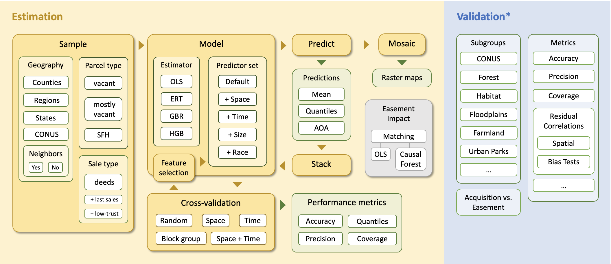

.. _Methods_Home:

Methods
=======

PLACES-FMV (CONUS) data are parcel-level **estimates** of fair market value (FMV) and associated uncertainties.

The :ref:`Estimation` component develops these estimates from data on private land transactions. Estimates are predictions made by :ref:`Models` that have been trained on sales of specific :ref:`Parcel types` in specific :ref:`Geographies` using different statistical :ref:`Estimators` and :ref:`Predictor sets`.

The :ref:`Validation` component examines the strength of correlations between FMV estimates and the actual cost of public land acquisitions and conservation easements in CONUS.

.. toctree::
   :maxdepth: 2
   :caption: Learn more

   methods/estimation
   methods/validation
