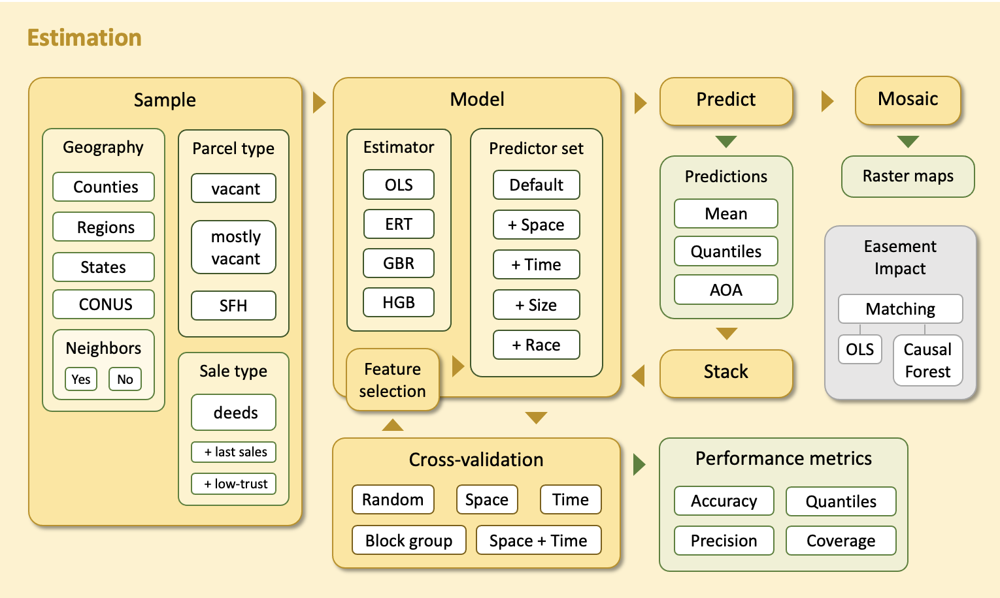

Estimation
==========

The **estimation** component generates estimates of fair market value (FMV) for vacant and :ref:`"mostly" vacant<"Mostly" vacant parcels>` properties in the contiguous United States.

FMV estimates are **predictions** (conditional means) produced by statistical :ref:`models <Models>` trained on :ref:`samples <Samples>` of millions of private property transactions. Models are trained at various :ref:`geographic scales <Geographies>` using simple :ref:`estimators <Estimators>` (linear regressions, tree ensembles) and publicly available :ref:`predictors<Predictor sets>`.

We also estimate associated :ref:`uncertainties <Uncertainty>` and identify the geographic regions for which these uncertainties are assumed to be valid (:ref:`areas of applicability <Area of Applicability (AOA)>`).

.. toctree::
   :maxdepth: 2

   estimation/samples
   estimation/models
   estimation/uncertainty
