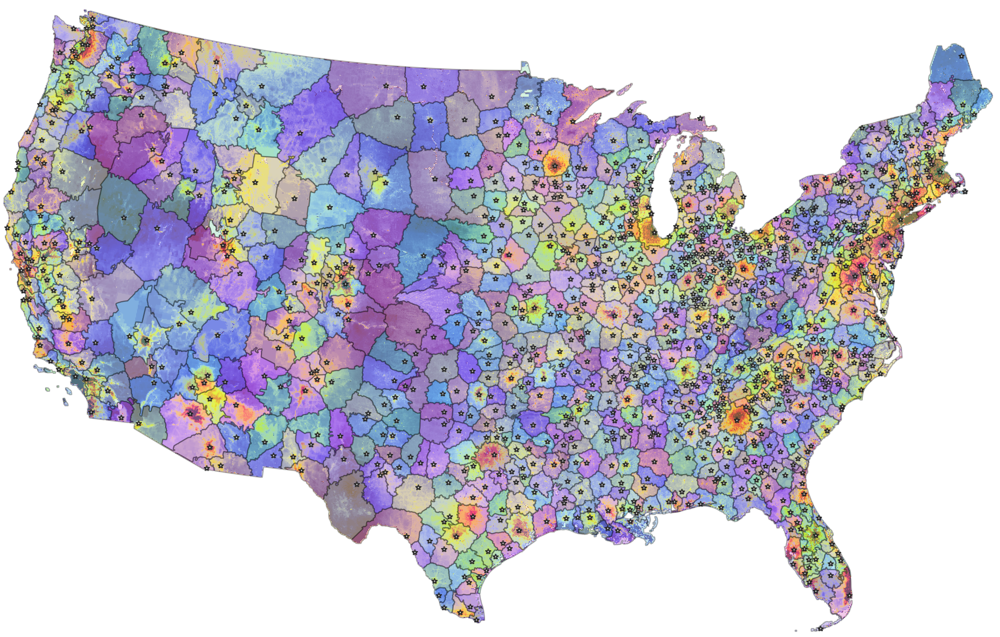

Geographies
===========

A **geography** defines the geographic location from which the training data sample is drawn:

* :ref:`regions <Regions>` and :ref:`neighbors <Region & neighbors>`
* :ref:`counties <Counties>` and :ref:`neighbors <County & neighbors>`
* :ref:`states <States>`
* :ref:`contiguous U.S. <CONUS>`

*******
Regions
*******

Regions refer to :ref:`core-based regions <Core-based regions>`, an experimental spatial unit created at the PLACES lab.

Regions are "grown" from high-value cores (cities, resorts) and meet at lower-value boundaries (see :ref:`data & methods <Core-based regions>`).

We prefer regions to counties or states for the purpose of fitting, comparing, and interpreting land value models. Official administrative units (counties, states) vary dramatically in their size and internal heterogeneity. Regions have similar sizes and comparable spatial compositions (cores and periphery).

Single-region
#############

Single-region models are based on sales data from one region.

:Identifier: ``region`` or region identifier (:any:`region_id`)
:Example: ``ca-losa`` is the core-based region around Los Angeles, California. It excludes Lancaster (which is located in LA county), but includes Anaheim, Santa Ana, Irvine (Orange county) as well as Thousand Oaks (Ventura county).

Region & neighbors
##################

"Region & neighbors" models are fit on sales data of a region and neighboring regions. Neighboring regions are regions whose boundaries are located within 10km or less of the boundaries of the target regions.

Most of our models use this geographic scale, as it offers the best predictive accuracy.

:Identifier: ``region-nb`` or region identifier (:any:`region_id`) with :code:`-nb` suffix.
:Example: ``ca-losa-nb`` includes the core-based region for Los Angeles, California, as well as its neighboring core-based regions (OTO, Lancaster, Victorville, Riversidee, San Diego)

********
Counties
********

Single-county
#############

Single-county models emulate the point of view of a county's property appraiser. They are run for each county, based on sales data from that county only.

:Identifier: ``county`` or 5-digit county FIPS code (:any:`fips`)

:Example: ``06037`` is Los Angeles county, California

County & neighbors
##################

"County & neighbors" models are fit on sales data of each county and its neighboring counties. Neighboring counties are counties whose boundaries are located within 10km or less of the boundaries of the target county.

County-level models with neighbors formed the basis of our first published high-resolution land value map (`article <https://www.pnas.org/doi/10.1073/pnas.2012865117>`_, `data download <https://doi.org/10.5061/dryad.np5hqbzq9>`_).

:Identifier: ``county-nb`` or 5-digit county FIPS code (:any:`fips`) with :code:`-nb` suffix.

:Example: ``06037-nb`` is Los Angeles county, California, and its five adjacent counties (Ventura, Kern, San Bernardino, Riverside, and Orange)

******
States
******

State models are based on sales data from a single state.

:Identifier: ``state`` or 2-letter state Alpha code (:any:`state`)
:Example: ``CA`` is California

*****
CONUS
*****

CONUS models are fit on data for the entire contiguous United States.

:Identifier: ``conus``

