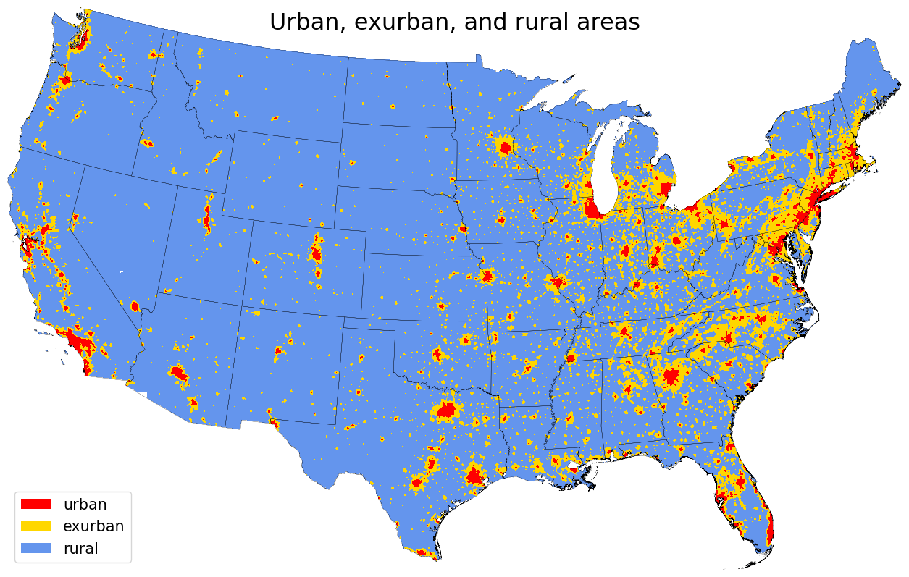

Parcel types
============

A **parceltype** identifies types of parcels included in sales data :ref:`samples <Samples>`.

***********
Vacant land
***********

We train our :ref:`models <Models>` on sales of vacant and "mostly" vacant properties.

This is by design: PLACES-FMV (CONUS) was designed to support conservation planning, and most land conservation transactions seek to protect land without buildings.

Excluding sales with buildings also avoids the challenge of accounting for heterogeneity in building value. Such heterogeneity can be substantial, and it is often shaped by attributes that we cannot observe consistently for the entire contiguous United States.

Vacant parcels
**************

Vacant parcels (``v``) are parcels which appear to have no buildings at the time of sale.

Vacant parcels need to pass the following filters:

- No detected building footprint :any:`p_bld_fp`
- No recorded positive building assessed value (:any:`val_b_za`) in linked tax assessor data.
- No recorded building market value (:any:`mv_b_za`) in linked tax assessor data.
- No standardized property land use code (:any:`bld_code`) that indicates the presence of a building (e.g. "single-family home")

"Mostly" vacant parcels
***********************

"Mostly" vacant parcels (``mv``) are parcels that are either fully vacant or that only have buildings of small size and/or value.

"Mostly" vacant parcels need to pass the following filters:

- Detected building footprint (:any:`p_bld_fp`) covers <0.1% of the parcel area.
- Recorded building assessed value (:any:`val_b_za`) is ≤0.1% of the total assessed value (:any:`val_t_za`)
- Recorded building market value (:any:`mv_b_za`) is ≤0.1% of the total assessed value (:any:`mv_t_za`)

In addition, samples of "mostly" vacant parcels need to contain ≥50% fully vacant parcels (`min_frac_vacant`).

*********************
Urban-rural gradients
*********************

Proximity to urban centers and resorts is a major driver of land value in the United States.

Conservation goals often differ between urban and remote locations. For organizations focused on urban parks or remote wildlife conservation, it is useful to know the drivers of land prices and associated uncertainties in their landscapes of interest.

We use our ":ref:`population gravity <Population gravity>`" raster (:any:`bld_pop_exp_c4`) to distinguish ``urban``, ``exurban``, and ``rural`` settings. Our cutoffs are: 0.09 to separate urban from exurban areas, and 0.008 to separate exurban from rural areas.

We fit separate models for each setting, as well as their combinations: ``urbex`` (urban + exurban) and ``exrur`` (exurban + rural). 

***************************
General parcel type filters
***************************

* All samples exclude properties smaller than one acre.

* All samples exclude properties with known conservation easements (:any:`p_e` > 20%, to avoid including encumbered purchases).

* All samples exclude properties that were part of a publicly financed land acquisition included in the :ref:`validation <Validation>` data (:any:`ct_p` > 20%, to avoid including validation data in the training sample).

* Some model samples apply custom filters to :ref:`predictor data <Predictors>`, e.g. to fit models specific to floodplains, wetlands, coastlines, forests, croplands, and pasture (see table below for details).

**************************
Parcel type specifications
**************************

.. csv-table::
  :file: ../cfg/parceltype.csv
  :stub-columns: 1
