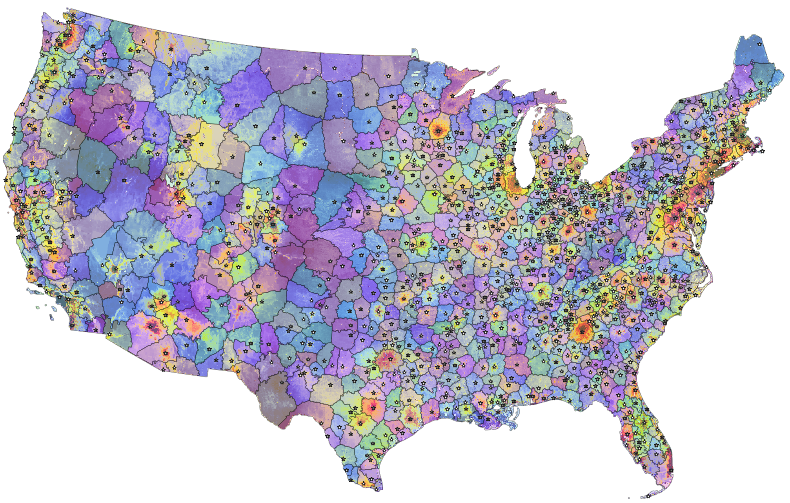
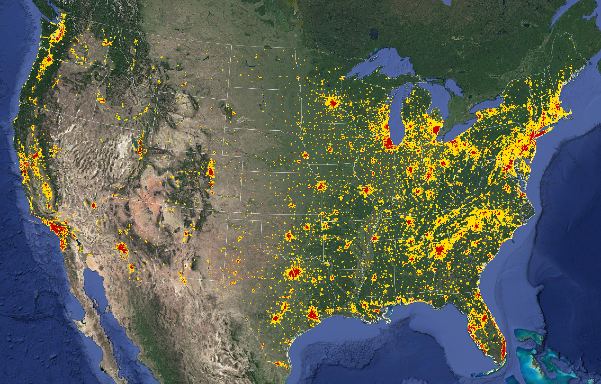

Submarkets
==========

Submarkets are defined by the location of parcels for sale.

In future iterations, they might also be defined by the characteristics of the parcels (e.g., size, building presence).

.. note::

   All models are fit on sales of **vacant** parcels. Exclusion criteria:

   * ``n_bld_fp == 0``: no Microsoft building footprints
   * ``n_bld_zcode == 0``: no use code commonly associated with buildings (ZTRAX)
   * ``mv_b_za == 0``: no positive building value (appraised/market) (ZTRAX)
   * ``val_b_za == 0``: no positive building valuation (ZTRAX)

*********************
Geographic submarkets
*********************

CONUS
#####

Models for the contiguous United States (CONUS) are based on a single statistical fit for all "Lower 48" states.

Identifier: ``conus``

Counties
########

County-level models are run for each county independently. They are fitted on a county's sales data and make predictions for parcels within in the county. They can be specified to also include sales observations from adjacent counties.

County-level models formed the basis of our first published high-resolution land value map (`Nolte (2020) PNAS <https://doi.org/10.5061/dryad.np5hqbzq9>`_).

Identifier: 5-digit county FIPS code (e.g. ``06037`` for Los Angeles county, California)

Regions
#######

Regions are our data-driven attempt to subdivide the CONUS landscape into spatial blocks that share common characteristics in their drivers of land values. If true, regional land value models might have higher predictive accuracy and interpretability overall than county-level models.

Our current approach to creating regions is to attribute each part of the U.S. landscape to a high-value core (usually cities or resorts) whose proximity drives the land rent gradient within that region.

Identifier: ``<region_id>`` (e.g. ``ca-losa`` for the Los Angeles core region in California, which includes part of Ventura and Orange county, but not Lancaster or San Antonio Heights).

.. toctree::
   :maxdepth: 2

   submarkets/regions

Urban-rural gradient
####################

Within regions, we fit separate models for urban, exurban, and rural properties.

For now, we have settled on the following definitions.

Urban
#####

Definition: >5% of the area within a 1km radius is covered with Microsoft building footprints.

Exurban
#######

Definition: not urban (see above), but >0.5% of the area within a 5km radius is covered with Microsoft building footprints.

Rural
#####

Definition: neither urban or exurban.
