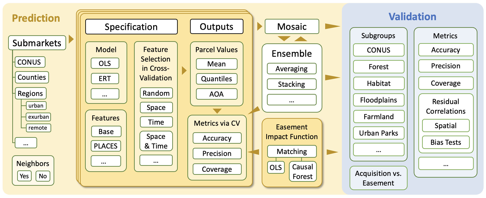

Overview
========

PLACES-FMV (CONUS) data are **estimates** of fair market value and of uncertainties.

Each estimate is the product of a model specification. Each model specification is a combination of:

* :ref:`Submarkets` in which the model was trained.
* :ref:`Estimators` that were used.
* a ``feature set`` (:math:`X`) used in training.

.. _Overview_Submarkets:

**********
Submarkets
**********

* **CONUS**

  A single set of models for the contiguous United States.

* **Counties**

  Separately fitted models for each county that has sufficient data.

.. toctree::
   :maxdepth: 2

   submarkets/regions

.. _Overview_Estimators:

**********
Estimators
**********

We will use both Ordinary Least Squares (OLS) and Extremely Randomized Trees (ERT).

************
Feature sets
************

* We start with the set of features used Nolte 2020 PNAS (see :ref:`Predictors`)

*************
Uncertainties
*************

Statistical support
###################

Statistical fit
###############

* AOC, R2

Cross-validation
################

Spatial, temporal, and spatio-temporal.

Area of applicability
#####################

Meyer & Pebesma (2021)
