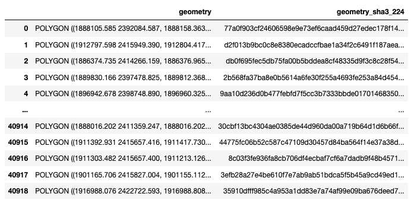

Data linkage
============

:any:`geometry_sha3_224` is our unique parcel identifier across all :ref:`parcel data <Parcel data>` products.

It is directly derived from geo-referenced parcel geometries (polygons). This allows other analysts with access to the same :ref:`parcel boundary data <Parcel boundaries>` to link up our data to theirs.

We picked :any:`geometry_sha3_224`, as it is:

* **easy to generate**: you need a parcel boundary vector file, `Python <https://www.python.org/>`_, and `geopandas <https://geopandas.org/en/stable/>`_.
* **unambiguous**: if our parcel identifiers match, you know you have the right polygon.
* **secure**: access to the published parcel identifiers does not permit the re-creation of parcel geometries (a precondition for publishing data derived from *licensed* :ref:`parcel boundaries <Parcel boundaries>`.)

*****************
Linkage algorithm
*****************

With this Python code snippet, you can generate :any:`geometry_sha3_224` from your parcel boundary data (geo-referenced polygons).

The code requires the Python package ``geopandas``, which provides functionality for vector data processing in Python (`installation instructions <https://geopandas.org/en/stable/getting_started/install.html>`_).

Replace ``PATH`` with the filepath to your parcel data file. 

Any vector file format supported by `fiona <https://fiona.readthedocs.io/en/latest/index.html>`_ should work (e.g. ``.shp``, ``.gpkg``, ``.gdb``).

If the vector data is provided in a different projection than `EPSG 5070 <https://geopandas.org/en/stable/getting_started/install.html>`_ (CONUS Albers), it will be reprojected first, which can take some time::

   import hashlib
   import geopandas as gpd

   # Path to your parcel data file
   PATH = '/folder_to_your_parcel_data/25011_parcels.gpkg'

   parcels = gpd.read_file(PATH)
   print('Load')

   if not parcels.crs == 'epsg:5070':
       parcels = parcels.to_crs('epsg:5070')
       print('Reproject')

   def to_sha3_224(x):
       m = hashlib.sha3_224()
       m.update(bytes(str(x), encoding='utf-8'))
       return m.hexdigest()

   parcels['geometry_sha3_224'] = parcels['geometry'].apply(to_sha3_224)
   t('Hash')

   parcels[['geometry', 'geometry_sha3_224']]

The last line will return a `pandas <https://pandas.pydata.org/pandas-docs/stable/index.html>`_ DataFrame that should look similar to this example (from Franklin county, Massachusetts). Save it with ``.to_csv(path)``, ``.to_excel(path)``, or similar.

