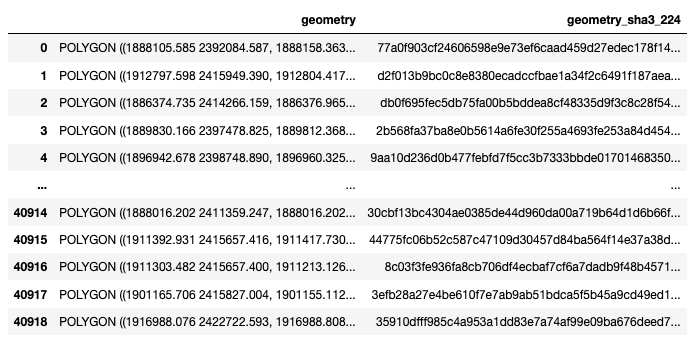

Parcel data
===========

Parcel data tables can be joined on their parcel identifier (see :ref:`Joining parcel data <Joining parcel data>`)

.. _parcel_data_yhat:

*********************************
Fair market value (FMV) estimates
*********************************

Parcel-level estimates of property value from :ref:`models <Models>`.

:Example:
 ``25011_parcel_predictions.pqt`` is a table of parcel-level predictor data for Franklin county, Massachusetts.

:File location:
 ``parcels/<state>/<county>/<county>_parcel_predictions_pqt.zip``

 * ``state`` is the 2-letter Alpha code of the state (see :any:`state`).
 * ``county`` is the 5-letter FIPS code of the county (see :any:`fips`).

:Columns:
 ``fmv_<model_id>_<year>``

 * ``model_id`` identifies the :ref:`model <Model specifications>`, and
 * ``year`` is the year for which the prediction was made.

:Unit:
 Natural logarithm of U.S. dollars (real, deflated to Jan 2022)

:Format:
  Compressed `Parquet <https://parquet.apache.org/docs/overview/>`_ table

.. _parcel_data_X:

**************
Predictor data
**************

Parcel-level table of all :ref:`predictors <Predictors>` used by :ref:`models <Models>`.

:Example:
 ``25011_parcel_predictors.pqt`` is a table of parcel-level predictor data for Franklin county, Massachusetts

:File location:
 ``parcels/<state>/<county>/<county>_parcel_predictions_pqt.zip``

 * ``state`` is the 2-letter Alpha code of the state (see :any:`state`).
 * ``county`` is the 5-letter FIPS code of the county (see :any:`fips`).

:Columns:
  For an interpretation of column names and units, see :ref:`predictors <Predictors>`.

:Format:
  Compressed `Parquet <https://parquet.apache.org/docs/overview/>`_ table

.. _parcel_data_support:

********************************
Area of applicability (AOA) data
********************************

Parcel-level indicators of the :ref:`Area of Applicability (AOA)` for the FMV estimates, standardized.

The AOA is a measure of **dissimilarity**: how "different" is each predicted parcel sale from the sales in the :ref:`sample <Samples>` that the predicting :ref:`model <Models>` was trained on?

It can help identify parts of the landscape for which predictions are extrapolated far beyond the characteristics of the original sample. If such extrapolation occurs, prediction errors and biases can (and often will) be larger than we were able to estimate from the training sample.

Such extrapolation can happen for a number of reasons: some parcels have a particularly unique set of characteristics, others are of a certain type that rarely sells (such as large government-owned lands), others might be located in parts of the landscape with few sales data observations (e.g. non-disclosure states).

Computationally, it is the Euclidean distance in weighted predictor space, where predictors are weighted by their importance in the model (see `Meyer & Pebesma 2021 <https://besjournals.onlinelibrary.wiley.com/doi/full/10.1111/2041-210X.13650>`_).

:Example:
 ``25011_parcel_aoa.pqt`` is a table of parcel-level AOA measures for Franklin county, Massachusetts

:File location:
 ``parcels/<state>/<county>/<county>_parcel_aoa_pqt.zip``

 * ``state`` is the 2-letter Alpha code of the state (see :any:`state`).
 * ``county`` is the 5-letter FIPS code of the county (see :any:`fips`).

:Columns:
 ``aoa_<model_id>_<year>_<cross-validation_type>``

 * ``model_id`` identifies the :ref:`model <Model specifications>`.
 * ``year`` is the year for which the prediction was made.
 * ``cross-validation_type`` identifies the type of :ref:`cross-validation <Cross-validation>` used to find the AOA threshold.

:Unit:
 Unitless distance, rescaled

 Values ≤0 are within the threshold of the :ref:`AOA <Area of Applicability (AOA)>`, values ≥0 are outside.

  .. math::
   
    ln(\frac{dissimilarity\;index}{AOA\;threshold})

:Format:
  Compressed `Parquet <https://parquet.apache.org/docs/overview/>`_ table

***********************
Joining parcel data
***********************

All :ref:`parcel data <Parcel data>` products use the same parcel identifier: :any:`geometry_sha3_224`

These are hashed geo-referenced parcel geometries (polygons). If you have access to the same :ref:`parcel boundary data <Parcel boundaries>`, you can link up our data to yours.

We picked :any:`geometry_sha3_224`, as it is:

* **easy to generate**: you need a parcel boundary vector file, `Python <https://www.python.org/>`_, and `geopandas <https://geopandas.org/en/stable/>`_.
* **unambiguous**: if our parcel identifiers match, you know you have the right polygon.
* **secure**: access to the published parcel identifiers does not permit the re-creation of parcel geometries.  
  This was a precondition for publishing data derived from licensed :ref:`parcel boundaries <Parcel boundaries>`.

Linkage algorithm
*****************

With this Python code snippet, you can generate :any:`geometry_sha3_224` from your parcel boundary data (geo-referenced polygons).

The code requires the Python package ``geopandas``, which provides functionality for vector data processing in Python (`installation instructions <https://geopandas.org/en/stable/getting_started/install.html>`_).

Replace ``PATH`` with the filepath to your parcel data file. 

Any vector file format supported by `fiona <https://fiona.readthedocs.io/en/latest/index.html>`_ should work (e.g. ``.shp``, ``.gpkg``, ``.gdb``).

If the vector data is provided in a different projection than `EPSG 5070 <https://geopandas.org/en/stable/getting_started/install.html>`_ (CONUS Albers), it will be reprojected. That step can take a few minutes or more.::

   import hashlib
   import geopandas as gpd

   # Path to your parcel data file
   PATH = '/folder_to_your_parcel_data/25011_parcels.gpkg'

   print('Reading...')
   parcels = gpd.read_file(PATH)

   if not parcels.crs == 'epsg:5070':
       print('Reprojecting...')
       parcels = parcels.to_crs('epsg:5070')

   def to_sha3_224(x):
       m = hashlib.sha3_224()
       m.update(bytes(str(x), encoding='utf-8'))
       return m.hexdigest()

   parcels['geometry_sha3_224'] = parcels['geometry'].apply(to_sha3_224)

   parcels[['geometry', 'geometry_sha3_224']]

The last line will return a `pandas <https://pandas.pydata.org/pandas-docs/stable/index.html>`_ DataFrame that should look similar to this one (Franklin county, Massachusetts, `MassGIS <https://www.mass.gov/info-details/massgis-data-property-tax-parcels>`_).

Save it with `.to_csv <https://pandas.pydata.org/pandas-docs/stable/reference/api/pandas.DataFrame.to_csv.html>`_, `.to_excel <https://pandas.pydata.org/pandas-docs/stable/reference/api/pandas.DataFrame.to_excel.html>`_, `.to_parquet <https://pandas.pydata.org/docs/reference/api/pandas.DataFrame.to_parquet.html>`_, etc.
