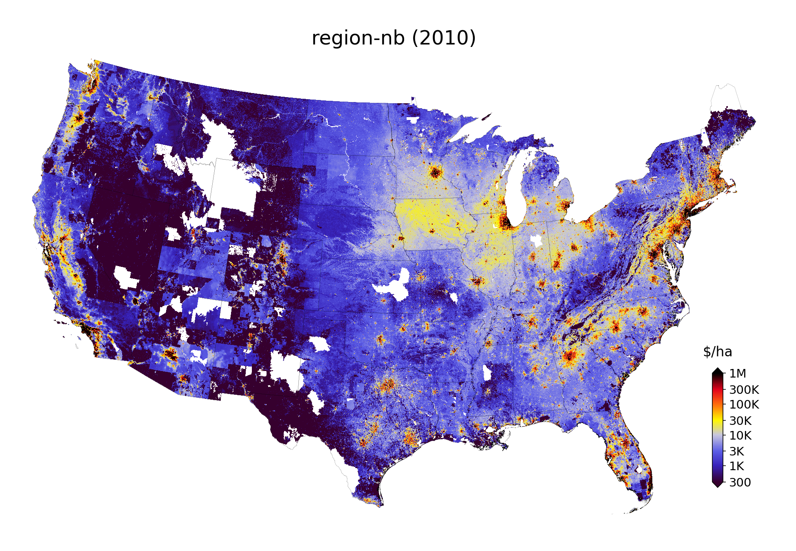
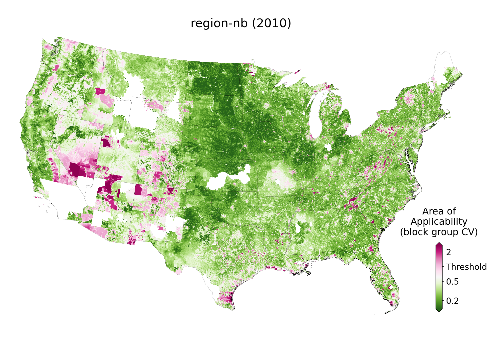

Raster data
===========

*******************************
Fair market value (FMV) rasters
*******************************

Rasterized :ref:`parcel-level estimates of fair market value (FMV) <Fair market value (FMV) estimates>` for the contiguous U.S.

:Example:
 ``fmv_region-nb_2010.tif`` is a land value raster with estimates from the :ref:`model <Model specifications>` ``region-nb`` (region & neighbors) for the year ``2010``.

:File location:
 ``rasters/estimates/fmv_<model_id>_<year>.tif``, where:

 * ``model_id`` identifies the :ref:`model <Model specifications>`, and
 * ``year`` is the year for which the prediction was made.

:Unit:
 Natural logarithm of U.S. dollars (real, deflated to Jan 2022), per area (hectare), divided by 16 and converted to ``uint8`` (0-255) to save space.

 .. math::
 
   \frac{ln(\frac{$}{hectare})}{16}

:Geoprocessing:
 Parcel-level estimates are assigned to their :ref:`parcel boundary polygons <Parcels>` and rasterized.

:Format: GeoTIFF
:Projection: Conus Albers (`EPSG:5070 <https://epsg.io/5070-1252>`_)
:Resolution: 480 x 480 meters (snapped to the `National Land Cover Database <https://www.mrlc.gov/data>`_)

***********************************
Area of applicability (AOA) rasters
***********************************

Parcel-level indicator of the :ref:`Area of Applicability (AOA)` for the FMV estimates, standardized and rasterized.

This is a measure of **dissimilarity**: how "different" is each predicted parcel sale from the sales in the :ref:`sample <Samples>` that the predicting :ref:`model <Models>` was trained on?

It can help identify parts of the landscape for which predictions are extrapolated far beyond the characteristics of the original sample. If such extrapolation occurs, prediction errors and biases can (and often will) be larger than we were able to estimate from the training sample.

Such extrapolation can happen for a number of reasons: some parcels have a particularly unique set of characteristics, others are of a certain type that rarely sells (such as large government-owned lands), others might be located in parts of the landscape with few sales data observations (e.g. non-disclosure states).

Computationally, it is the Euclidean distance in weighted predictor space, where predictors are weighted by their importance in the model (see `Meyer & Pebesma 2021 <https://besjournals.onlinelibrary.wiley.com/doi/full/10.1111/2041-210X.13650>`_).

:Example:
 ``aoa_region-nb_2010_bg.tif`` is a raster of the area of applicability.

 * For the :ref:`model <Model specifications>` ``region-nb``
 * For predictions made in the year ``2010``
 * For which the AOA threshold was determined via :ref:`cross-validation <Cross-validation>` blocked by census block groups (``bg``).

:File location:
 ``rasters/support/aoa_<model_id>_<year>_<cross-validation_type>.tif``:

 * ``model_id`` identifies the :ref:`model <Model specifications>`.
 * ``year`` is the year for which the prediction was made.
 * ``cross-validation_type`` identifies the type of :ref:`cross-validation <Cross-validation>` used to find the AOA threshold.

:Unit:
 Unitless distance, rescaled and converted to ``uint8`` (0-255).

 Values ≤100 are within the threshold of the :ref:`AOA <Area of Applicability (AOA)>`, values ≥100 are outside.

 Our conversion preserves much of the data heterogeneity within a ``uint8`` variable scope (which saves space).

  .. math::
   
    ln(\frac{dissimilarity\;index}{AOA\;threshold}) - 4) * 25

 where:

 * ``dissimilarity index`` is the dissimilarity index proposed by `Meyer & Pebesma 2021 <https://besjournals.onlinelibrary.wiley.com/doi/full/10.1111/2041-210X.13650>`_.
 * ``AOA threshold`` is the proposed threshold on the dissimilarity index to identify the "Area of Applicability".

:Format: GeoTIFF
:Projection: Conus Albers (`EPSG:5070 <https://epsg.io/5070-1252>`_)
:Resolution: 480 x 480 meters (snapped to the `National Land Cover Database <https://www.mrlc.gov/data>`_)

